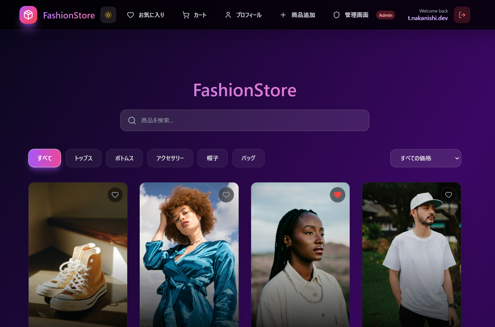
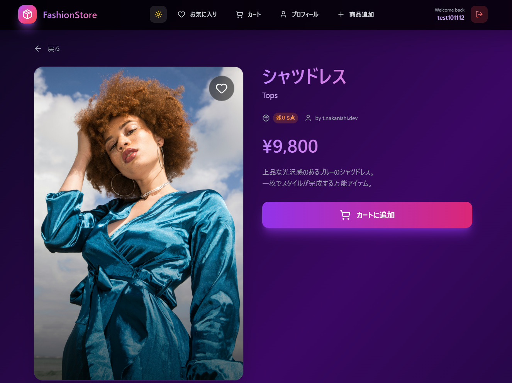
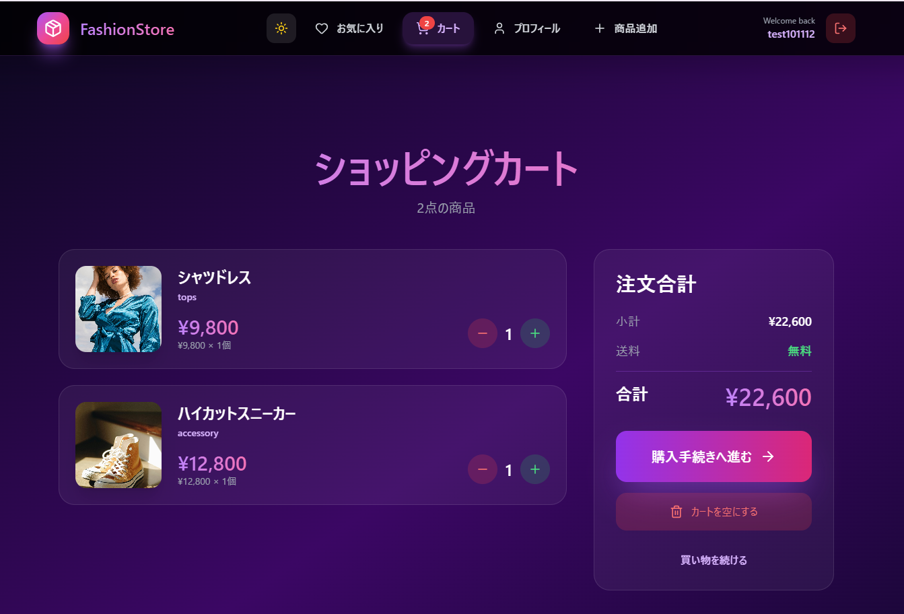
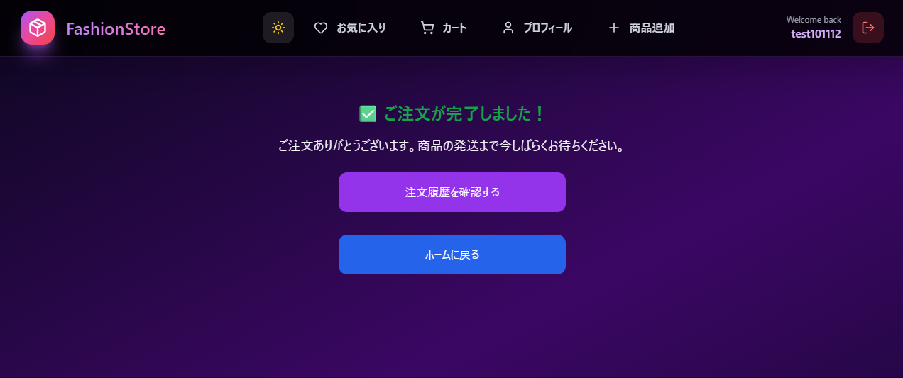
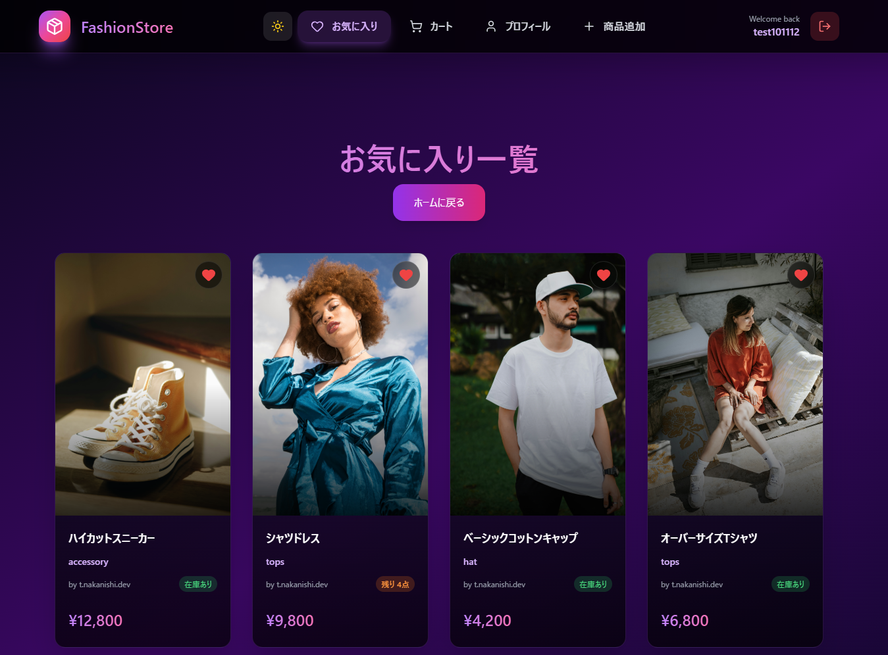
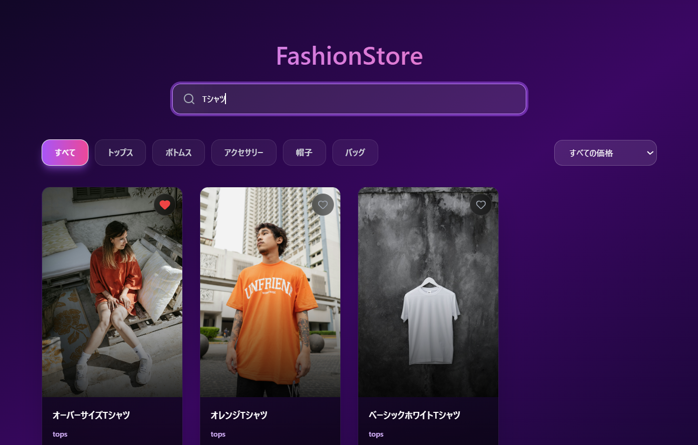

# 🛍️ MERN Fashion App – ファッションECサイト

## 🔗 デプロイURL
https://mern-fashion-app-frontend-8qxk.onrender.com
※スマートフォン・PCの両方に対応しています。

## 🔑 テストログイン
Email: t.nakanishi.dev@gmail.com
Password: t.nakanishi.dev  

## 📸 スクリーンショット

### ホーム画面

### 商品詳細画面

### カート画面

### 注文完了画面

### お気に入り画面

### 商品検索画面

## 📝 アプリ概要
このアプリは、最新のファッションアイテムを閲覧・購入できる  
MERNスタックを用いたフルスタックECサイトです。  
ユーザーは商品を閲覧し、カートに追加して購入手続きを行うことができます。  
また、管理者アカウントでは商品の登録・編集・削除も可能です。  
加えて、**お気に入り機能** で気に入った商品を保存でき、  
**検索機能** で商品を簡単に探し出すことができます。

## 🔧 使用技術
- **フロントエンド**：React, Vite, Tailwind CSS, React Router  
- **バックエンド**：Node.js, Express  
- **データベース**：MongoDB（Mongoose）  
- **認証 / 決済**：Firebase Auth, Stripe API  
- **ホスティング**：Render  

## ✨ 主な機能
- 👗 **商品閲覧機能**：カテゴリー別・価格順で商品を一覧表示  
- 🛒 **ショッピングカート機能**：カートへの追加・削除・数量変更  
- 💳 **購入機能**：Stripeを用いた安全なクレジット決済  
- 👤 **ユーザー認証**：Firebase Authでのログイン・新規登録  
- 🧾 **注文履歴管理**：ユーザーごとの購入履歴を閲覧可能  
- ❤️ **お気に入り機能**：気に入った商品をお気に入りに追加  
- 🔍 **商品検索機能**：検索バーで商品名やカテゴリーでフィルタ可能  
- 🛠️ **管理者機能**：商品登録・編集・削除  
- 📱 **レスポンシブ対応**：スマートフォン・PC両対応デザイン  

## 💡 工夫した点
- Stripe決済のテスト環境を用いて安全な決済フローを実装  
- Context APIでカート状態をグローバル管理し、再描画を最小化  
- 商品データをMongoDBで柔軟に管理（カテゴリー・価格帯など）  
- Tailwindによるシンプルで直感的なUIデザイン  
- Firebase認証でセキュアなユーザーログインを実現  
- お気に入り機能を利用して、ユーザーが気に入った商品を簡単に保存・管理できるように実装  
- 商品検索バーで名前やカテゴリーで絞り込みができ、ユーザーの利便性を向上  

## 👤 作者情報
- 名前：t-nakanishi-dev
- GitHub：https://github.com/t-nakanishi-dev
